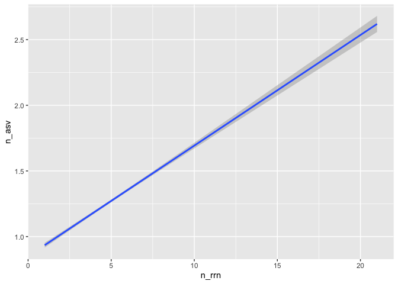

Analyzing the sensitivity and specificity of ASVs for discriminating
between genomes
================
Pat Schloss
9/9/2020

    library(tidyverse)
    library(here)

### Need to determine the numbe of *rrn* operons across genomes

Our analysis will use full length sequences

    fl <- read_tsv(here("data/v19/rrnDB.count_tibble"))

    ## Parsed with column specification:
    ## cols(
    ##   asv = col_character(),
    ##   genome = col_character(),
    ##   count = col_double()
    ## )

We want to count and plot the number of copies per genome

    fl %>%
        group_by(genome) %>%
        summarize(n_rrn = sum(count), .groups="drop") %>%
        ggplot(aes(x=n_rrn)) + geom_histogram(binwidth=1)

<!-- -->

    fl %>%
        group_by(genome) %>%
        summarize(n_rrn = sum(count), .groups="drop") %>%
        count(n_rrn) %>%
        mutate(fraction = n / sum(n))

    ## # A tibble: 20 x 3
    ##    n_rrn     n  fraction
    ##    <dbl> <int>     <dbl>
    ##  1     1  1566 0.102    
    ##  2     2  1740 0.113    
    ##  3     3  2143 0.139    
    ##  4     4  1769 0.115    
    ##  5     5  1232 0.0801   
    ##  6     6  2120 0.138    
    ##  7     7  2671 0.174    
    ##  8     8   964 0.0626   
    ##  9     9   363 0.0236   
    ## 10    10   322 0.0209   
    ## 11    11   140 0.00910  
    ## 12    12   157 0.0102   
    ## 13    13    66 0.00429  
    ## 14    14   101 0.00656  
    ## 15    15    23 0.00149  
    ## 16    16     5 0.000325 
    ## 17    17     4 0.000260 
    ## 18    18     1 0.0000650
    ## 19    19     1 0.0000650
    ## 20    21     1 0.0000650

We see that most genomes actually have more than one copy of the *rrn*
operon. I wonder whether those different copies are the same sequence /
ASV…

### Determine number of ASVs per genome

Considering most genomes have multiple copes of the *rrn* operon, we
need to know whether they all have the same ASV. Otherwise we run the
risk of splitting a single genome into multiple ASVs.

    fl %>% 
        group_by(genome) %>%
        summarize(n_asv = n(), n_rrn = sum(count), .groups="drop") %>%
        group_by(n_rrn) %>%
        summarize(med_n_asv = median(n_asv),
                            lq_n_asv = quantile(n_asv, prob=0.25),
                            uq_n_asv = quantile(n_asv, prob=0.75))

    ## `summarise()` ungrouping output (override with `.groups` argument)

    ## # A tibble: 20 x 4
    ##    n_rrn med_n_asv lq_n_asv uq_n_asv
    ##    <dbl>     <dbl>    <dbl>    <dbl>
    ##  1     1       1        1        1  
    ##  2     2       1        1        2  
    ##  3     3       1        1        2  
    ##  4     4       2        1        2  
    ##  5     5       3        1        4  
    ##  6     6       3        1        4  
    ##  7     7       5        3        6  
    ##  8     8       6        4        7  
    ##  9     9       7        5        8  
    ## 10    10       7        5        9  
    ## 11    11       8        6        9  
    ## 12    12       9        7       10  
    ## 13    13       9        7       11  
    ## 14    14       9        8       11  
    ## 15    15      11        9       14  
    ## 16    16      10        9       14  
    ## 17    17      14.5     12.5     16.2
    ## 18    18      14       14       14  
    ## 19    19      17       17       17  
    ## 20    21      11       11       11

    fl %>% 
        group_by(genome) %>%
        summarize(n_asv = n(), n_rrn = sum(count), .groups="drop") %>%
        ggplot(aes(x=n_rrn, y=n_asv)) + geom_smooth(method="lm")

    ## `geom_smooth()` using formula 'y ~ x'

<!-- -->

Surprisingly (or not!) the number of ASVs increases at a rate of about 2
ASVs per 3 copies of *rrn* operon in the genome.

### Determine whether an ASV is unique to genomes they’re found in

Instead of looking at the number of ASVs per genome, we want to see the
number of genomes per ASV.

    fl %>%
        group_by(asv) %>%
        summarize(n_genomes = n()) %>%
        count(n_genomes) %>%
        mutate(fraction = n/sum(n))

    ## `summarise()` ungrouping output (override with `.groups` argument)

    ## # A tibble: 98 x 3
    ##    n_genomes     n fraction
    ##        <int> <int>    <dbl>
    ##  1         1 19246  0.824  
    ##  2         2  2037  0.0872 
    ##  3         3   675  0.0289 
    ##  4         4   354  0.0152 
    ##  5         5   234  0.0100 
    ##  6         6   116  0.00497
    ##  7         7    99  0.00424
    ##  8         8    71  0.00304
    ##  9         9    73  0.00312
    ## 10        10    44  0.00188
    ## # … with 88 more rows

We see that will full length sequences, that 82% of the ASVs were unique
to a genome.

### Does the sensitivity and specificity change if we look at a shorter region of the gene?

We know that the V4 region is less diverse than the full length
sequence. So does the number of ASVs per genome differ than for full
length sequences? Are ASVs as specific when using the V4 region compared
to full length sequences?

    v_four <- read_tsv(here("data/v4/rrnDB.count_tibble"))

    ## Parsed with column specification:
    ## cols(
    ##   asv = col_character(),
    ##   genome = col_character(),
    ##   count = col_double()
    ## )

    v_four %>% 
        group_by(genome) %>%
        summarize(n_asv = n(), n_rrn = sum(count), .groups="drop") %>%
        group_by(n_rrn) %>%
        summarize(mean_n_asv = mean(n_asv),
                            lq_n_asv = quantile(n_asv, prob=0.25),
                            uq_n_asv = quantile(n_asv, prob=0.75))

    ## `summarise()` ungrouping output (override with `.groups` argument)

    ## # A tibble: 20 x 4
    ##    n_rrn mean_n_asv lq_n_asv uq_n_asv
    ##    <dbl>      <dbl>    <dbl>    <dbl>
    ##  1     1       1           1        1
    ##  2     2       1.07        1        1
    ##  3     3       1.08        1        1
    ##  4     4       1.16        1        1
    ##  5     5       1.27        1        1
    ##  6     6       1.19        1        1
    ##  7     7       1.48        1        2
    ##  8     8       1.66        1        2
    ##  9     9       1.53        1        2
    ## 10    10       1.82        1        2
    ## 11    11       2.01        1        2
    ## 12    12       1.80        1        2
    ## 13    13       1.73        1        2
    ## 14    14       2.09        1        2
    ## 15    15       2.52        1        3
    ## 16    16       1.6         1        2
    ## 17    17       3.6         1        4
    ## 18    18       2           2        2
    ## 19    19       3           3        3
    ## 20    21       1           1        1

    v_four %>% 
        group_by(genome) %>%
        summarize(n_asv = n(), n_rrn = sum(count), .groups="drop") %>%
        ggplot(aes(x=n_rrn, y=n_asv)) + geom_smooth(method="lm")

    ## `geom_smooth()` using formula 'y ~ x'

<!-- -->

The number of ASVs per copy of *rrn* operon is lower than for full
length sequences. We find 1.5 ASV per 10 copies of the *rrn* operon.

Next, let’s look at the specificity of an ASV for a genome

    v_four %>%
        group_by(asv) %>%
        summarize(n_genomes = n()) %>%
        count(n_genomes) %>%
        mutate(fraction = n/sum(n))

    ## `summarise()` ungrouping output (override with `.groups` argument)

    ## # A tibble: 80 x 3
    ##    n_genomes     n fraction
    ##        <int> <int>    <dbl>
    ##  1         1  4592  0.759  
    ##  2         2   633  0.105  
    ##  3         3   260  0.0430 
    ##  4         4   120  0.0198 
    ##  5         5    80  0.0132 
    ##  6         6    49  0.00810
    ##  7         7    40  0.00661
    ##  8         8    31  0.00512
    ##  9         9    25  0.00413
    ## 10        10    22  0.00364
    ## # … with 70 more rows

We find that about 76% of ASVs using the V4 region were specific to a
genome.

### To be determined…

-   Can correct for over representation?
-   Consider analysis at species, genus, family, etc. levels
-   Consider looking at more broad definition of an ASV
