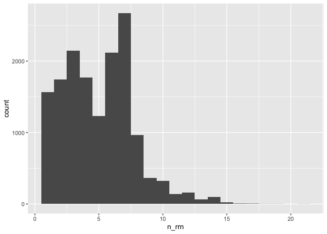
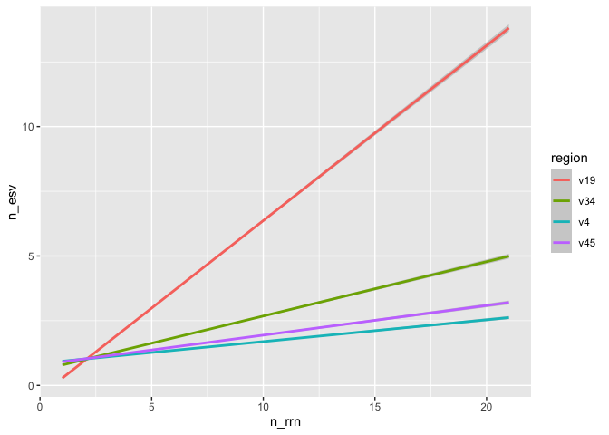

Analyzing the sensitivity and specificity of ESVs for discriminating
between genomes
================
Pat Schloss
9/9/2020

    library(tidyverse)
    library(here)

### Need to determine the numbe of *rrn* operons across genomes

Our analysis will use full length sequences

    count_tibble <- read_tsv(here("data/processed/rrnDB.easv.count_tibble"),
                                    col_types = cols(.default = col_character(),
                                                                     count = col_integer())) %>%
        filter(threshold == "esv") %>%
        select(-threshold)

We want to count and plot the number of copies per genome

    count_tibble %>%
        filter(region == "v19") %>%
        group_by(genome) %>%
        summarize(n_rrn = sum(count), .groups="drop") %>%
        ggplot(aes(x=n_rrn)) + geom_histogram(binwidth=1)

<!-- -->

    count_tibble %>%
        filter(region == "v19") %>%
        group_by(genome) %>%
        summarize(n_rrn = sum(count)) %>%
        count(n_rrn) %>%
        mutate(fraction = n / sum(n))

    ## `summarise()` ungrouping output (override with `.groups` argument)

    ## # A tibble: 20 x 3
    ##    n_rrn     n  fraction
    ##    <int> <int>     <dbl>
    ##  1     1  1566 0.102    
    ##  2     2  1740 0.113    
    ##  3     3  2143 0.139    
    ##  4     4  1769 0.115    
    ##  5     5  1232 0.0801   
    ##  6     6  2120 0.138    
    ##  7     7  2671 0.174    
    ##  8     8   964 0.0626   
    ##  9     9   363 0.0236   
    ## 10    10   322 0.0209   
    ## 11    11   140 0.00910  
    ## 12    12   157 0.0102   
    ## 13    13    66 0.00429  
    ## 14    14   101 0.00656  
    ## 15    15    23 0.00149  
    ## 16    16     5 0.000325 
    ## 17    17     4 0.000260 
    ## 18    18     1 0.0000650
    ## 19    19     1 0.0000650
    ## 20    21     1 0.0000650

We see that most genomes actually have more than one copy of the *rrn*
operon. I wonder whether those different copies are the same sequence /
ESV…

### Determine number of ESVs per genome

Considering most genomes have multiple copes of the *rrn* operon, we
need to know whether they all have the same ESV. Otherwise we run the
risk of splitting a single genome into multiple ESVs.

    count_tibble %>%
        group_by(region, genome) %>%
        summarize(n_esv = n(), n_rrn = sum(count), .groups="drop") %>%
        group_by(region, n_rrn) %>%
        summarize(med_n_esv = median(n_esv),
                            mean_n_esv = mean(n_esv),
                            lq_n_esv = quantile(n_esv, prob=0.25),
                            uq_n_esv = quantile(n_esv, prob=0.75)) %>%
        filter(n_rrn == 7)

    ## `summarise()` regrouping output by 'region' (override with `.groups` argument)

    ## # A tibble: 4 x 6
    ## # Groups:   region [4]
    ##   region n_rrn med_n_esv mean_n_esv lq_n_esv uq_n_esv
    ##   <chr>  <int>     <dbl>      <dbl>    <dbl>    <dbl>
    ## 1 v19        7         5       4.51        3        6
    ## 2 v34        7         2       2.10        1        3
    ## 3 v4         7         1       1.48        1        2
    ## 4 v45        7         1       1.64        1        2

    count_tibble %>%
        group_by(region, genome) %>%
        summarize(n_esv = n(), n_rrn = sum(count), .groups="drop") %>%
        ggplot(aes(x=n_rrn, y=n_esv, color=region)) + geom_smooth(method="lm")

    ## `geom_smooth()` using formula 'y ~ x'

<!-- -->

Surprisingly (or not!) the number of ESVs increases at a rate of about 2
ESVs per 3 copies of *rrn* operon in the genome. The sub regions of the
16S rRNA region have few ESVs per *rrn* operon.

### Determine whether an ESV is unique to genomes they’re found in

Instead of looking at the number of ESVs per genome, we want to see the
number of genomes per ESV.

    count_tibble %>%
        group_by(region, easv) %>%
        summarize(n_genomes = n()) %>%
        count(n_genomes) %>%
        mutate(fraction = n/sum(n)) %>%
        filter(n_genomes == 1)

    ## `summarise()` regrouping output by 'region' (override with `.groups` argument)

    ## # A tibble: 4 x 4
    ## # Groups:   region [4]
    ##   region n_genomes     n fraction
    ##   <chr>      <int> <int>    <dbl>
    ## 1 v19            1 19246    0.824
    ## 2 v34            1  7246    0.779
    ## 3 v4             1  4592    0.759
    ## 4 v45            1  5717    0.778

We see that will full length sequences, that 82% of the ESVs were unique
to a genome. For the subregions, about 76% of the ESVs were unique to a
genome.

### To be determined…

-   Can correct for over representation?
-   Consider analysis at species, genus, family, etc. levels
-   Consider looking at more broad definition of an ESV
