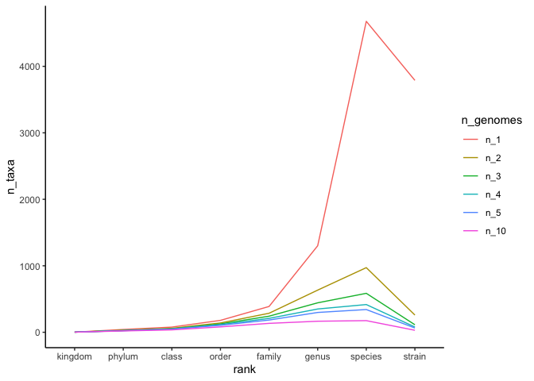

Analyzing the distribution of genomes across different taxonomic ranks
================
Pat Schloss
9/29/2020

    library(tidyverse)
    library(here)

    metadata <- read_tsv(here("data/references/genome_id_taxonomy.tsv"),
                                             col_types = cols(.default = col_character())) %>%
        mutate(strain = if_else(scientific_name == species,
                                                        NA_character_,
                                                        scientific_name)) %>%
        select(-scientific_name) %>% 
        pivot_longer(-genome_id, names_to="rank", values_to="taxon") %>%
        drop_na(taxon) %>%
        mutate(rank = factor(rank,
                                                 levels=c("kingdom", "phylum", "class", "order",
                                                                 "family", "genus", "species", "strain")))

    asv <- read_tsv(here("data/processed/rrnDB.count_tibble"),
                                    col_types = cols(.default = col_character(),
                                                                     count = col_integer()))

    metadata_asv <- inner_join(metadata, asv, by=c("genome_id" = "genome"))

### Find the number of taxa within each taxonomic rank

    n_taxa_per_rank <- metadata_asv %>%
        filter(region == "v19") %>% 
        group_by(rank, taxon) %>%
        summarize(N = n_distinct(genome_id)) %>%
        summarize(n_1 = n_distinct(taxon),
                            n_2 = sum(N >= 2),
                            n_3 = sum(N >= 3),
                            n_4 = sum(N >= 4),
                            n_5 = sum(N >= 5),
                            n_10 = sum(N >= 10)
                            ) %>%
        pivot_longer(-rank, names_to = "n_genomes", values_to="n_taxa") %>%
        mutate(n_genomes = factor(n_genomes,
                                                            levels=c("n_1", "n_2", "n_3", "n_4", "n_5", "n_10")))

    ## `summarise()` regrouping output by 'rank' (override with `.groups` argument)

    ## `summarise()` ungrouping output (override with `.groups` argument)

    n_taxa_per_rank %>% 
        ggplot(aes(x=rank, y=n_taxa, group=n_genomes, color=n_genomes)) +
            geom_line() + 
            theme_classic()

<!-- -->

-   Even if we require that ever taxonomic group had at least 5 genomes,
    there would be a few hundred species represented
-   Not sure I trust the strain level data as being complete. There
    maybe taxa in the strain rank that are in the species but the people
    that deposited the data didn’t indicate the correct strain name
