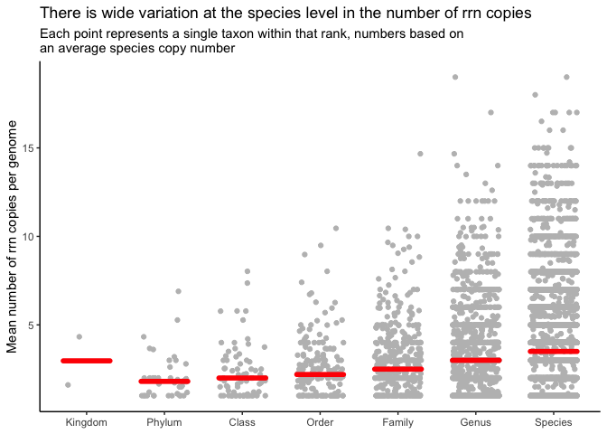
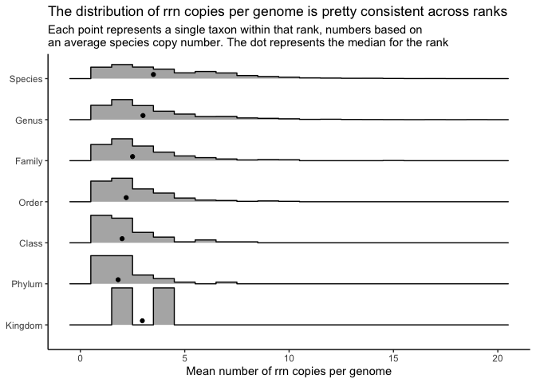

Quantifying the number of *rrn* operons across taxonomic ranks
================
Pat Schloss
10/05/2020

    library(tidyverse)
    library(here)

    metadata <- read_tsv(here("data/references/genome_id_taxonomy.tsv"),
                                             col_types = cols(.default = col_character())) %>%
        mutate(strain = if_else(scientific_name == species,
                                                        NA_character_,
                                                        scientific_name)) %>%
        select(-scientific_name)

    esv <- read_tsv(here("data/processed/rrnDB.esv.count_tibble"),
                                    col_types = cols(.default = col_character(),
                                                                     count = col_integer()))

    metadata_esv <- inner_join(metadata, esv, by=c("genome_id" = "genome"))

### Plot the number of *rrn* copies per taxonomic rank

Our analysis will use full length sequences. We want to count and plot
the number of copies per *taxonomic rank*. Before calculating the
averages of each taxonomic group, we should first get an average number
of copies for each species. This will allow us to control for uneven
number of genomes in each species.

    rank_taxon_rrns <- metadata_esv %>%
        filter(region == "v19") %>%
        group_by(kingdom, phylum, class, order, family, genus, species, genome_id) %>%
        summarize(n_rrns = sum(count), .groups="drop") %>%
        group_by(kingdom, phylum, class, order, family, genus, species) %>%
        summarize(mean_rrns = mean(n_rrns), .groups="drop") %>%
        pivot_longer(-mean_rrns, names_to="rank", values_to="taxon") %>%
        drop_na(taxon) %>%
        mutate(rank = factor(rank,
                                                 levels=c("kingdom", "phylum", "class", "order",
                                                                 "family", "genus", "species", "strain"))) %>%
        group_by(rank, taxon) %>%
        summarize(mean_rrns = mean(mean_rrns), .groups="drop")

    median_of_means <- rank_taxon_rrns %>%
        group_by(rank) %>%
        summarize(median_mean_rrns = median(mean_rrns), .groups="drop")

    jitter_width <- 0.3
    n_ranks <- nrow(median_of_means)

    rank_taxon_rrns %>%
        ggplot(aes(x=rank, y=mean_rrns)) +
        geom_jitter(width=jitter_width, color="gray") +
        geom_segment(data=median_of_means,
                                 aes(x=1:n_ranks-jitter_width, xend=1:n_ranks+jitter_width,
                                        y=median_mean_rrns, yend=median_mean_rrns),
                             color="red", group=1, size=2, lineend="round",
                             inherit.aes=FALSE) +
        theme_classic() +
        labs(x=NULL,
                 y="Mean number of rrn copies per genome",
                 title="There is wide variation at the species level in the number of rrn copies",
                 subtitle="Each point represents a single taxon within that rank, numbers based on\nan average species copy number") +
        scale_x_discrete(breaks=c("kingdom", "phylum", "class", "order", "family", "genus", "species"),
                                         labels=c("Kingdom", "Phylum", "Class", "Order", "Family", "Genus", "Species"))

<!-- -->

Here’s another way of looking at the data…

    library(ggridges)

    rank_taxon_rrns %>%
        ggplot(aes(y=rank, x=mean_rrns)) +
        geom_density_ridges(stat="binline", binwidth=1, scale=0.9) +
        geom_point(data=median_of_means, aes(x=median_mean_rrns, y=1:n_ranks+0.1)) +
        theme_classic() +
        labs(y=NULL,
                 x="Mean number of rrn copies per genome",
                 title="The distribution of rrn copies per genome is pretty consistent across ranks",
                 subtitle="Each point represents a single taxon within that rank, numbers based on\nan average species copy number. The dot represents the median for the rank") +
        scale_y_discrete(breaks=c("kingdom", "phylum", "class", "order", "family", "genus", "species"),
                                         labels=c("Kingdom", "Phylum", "Class", "Order", "Family", "Genus", "Species"))

<!-- -->

-   Bacteria have more copies than Archaea
-   Even after correcting for number of genomes per species, there is
    wide variation in the number of rrn operons per taxonomic group
