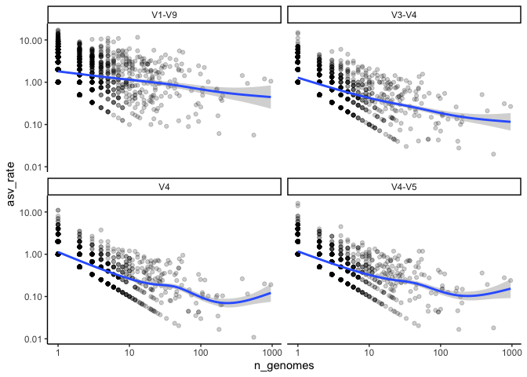

Quantifying the coverage of ASVs within a species
================
Pat Schloss
10/05/2020

    library(tidyverse)
    library(here)

    metadata <- read_tsv(here("data/references/genome_id_taxonomy.tsv"),
                                             col_types = cols(.default = col_character())) %>%
        mutate(strain = if_else(scientific_name == species,
                                                        NA_character_,
                                                        scientific_name)) %>%
        select(-scientific_name)

    asv <- read_tsv(here("data/processed/rrnDB.count_tibble"),
                                    col_types = cols(.default = col_character(),
                                                                     count = col_integer()))

    metadata_asv <- inner_join(metadata, asv, by=c("genome_id" = "genome"))

### Does the number of ASVs per species increase with sampling effort? Does this vary by region within the 16S rRNA gene?

We’ve previously seen that the number of ASVs per copy of the 16S rRNA
gene is about 0.6. This means that if a genome has 10 copies of the 16S
rRNA gene, we would expect to see about 6 different versions of the gene
within that genome. Across genomes from the same species, we know that
the number of copies of the gene is pretty consistent. So, if we look at
multiple genomes from the same species, will we see the same versions of
the gene or will we see new versions of the gene? To answer this, we
would like to look at the relationship between the number of ASVs found
in a species per number of genomes in the species versus the number of
genomes. Besides looking at the full length sequences, let’s also look
at the V4, V3-V4, and V4-V5 regions.

    #x = number of genomes for that species
    #y = ratio of the number of ASVs per genome
    # each point represents a different species
    # each facet represents a different region

    species_asvs <- metadata_asv %>% 
        select(genome_id, species, region, asv) %>%
        group_by(region, species) %>%
        summarize(n_genomes = n_distinct(genome_id),
                            n_asvs = n_distinct(asv),
                            asv_rate = n_asvs/n_genomes,
                            .groups="drop")

    region_labels <- c("V1-V9", "V4", "V3-V4", "V4-V5")
    names(region_labels) <- c("v19", "v4", "v34", "v45")

    species_asvs %>%
        ggplot(aes(x=n_genomes, y=asv_rate)) +
        geom_point(alpha=0.2) +
        geom_smooth() + 
        facet_wrap(facet="region",
                             nrow=2,
                             strip.position = "top",
                             scales="fixed",
                             labeller=labeller(region = region_labels)) +
        scale_x_log10()+
        scale_y_log10() +
        theme_classic()

    ## `geom_smooth()` using method = 'gam' and formula 'y ~ s(x, bs = "cs")'

<!-- -->

### Conclusions

-   V1-V9 continues to add significant number of ASVs as more genomes
    are sampled from a species
-   The sub regions seem to have plateaued indicating that perhaps we’ll
    always add more ASVs for a species
-   Perhaps we really are splitting genomes and species too finely with
    ASVs
-   Would like to look at individual genomes in more detail
