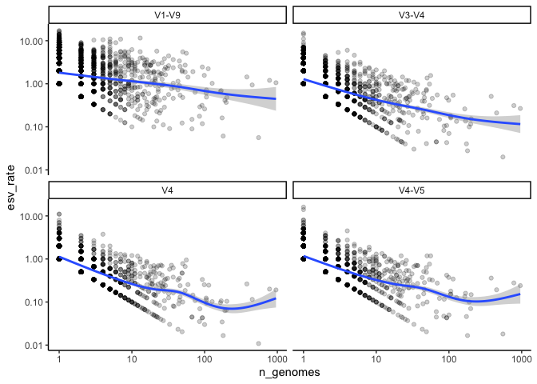

Quantifying the coverage of ESVs within a species
================
Pat Schloss
10/15/2020

    library(tidyverse)
    library(knitr)
    library(here)

    metadata <- read_tsv(here("data/references/genome_id_taxonomy.tsv"),
                                             col_types = cols(.default = col_character())) %>%
        mutate(strain = if_else(scientific_name == species,
                                                        NA_character_,
                                                        scientific_name)) %>%
        select(-scientific_name)

    esv <- read_tsv(here("data/processed/rrnDB.easv.count_tibble"),
                                    col_types = cols(.default = col_character(),
                                                                     count = col_integer())) %>%
        filter(threshold == "esv") %>%
        select(-threshold)

    metadata_esv <- inner_join(metadata, esv, by=c("genome_id" = "genome"))

### Does the number of ESVs per species increase with sampling effort? Does this vary by region within the 16S rRNA gene?

We’ve previously seen that the number of ESVs per copy of the 16S rRNA
gene is about 0.6. This means that if a genome has 10 copies of the 16S
rRNA gene, we would expect to see about 6 different versions of the gene
within that genome. Across genomes from the same species, we know that
the number of copies of the gene is pretty consistent. So, if we look at
multiple genomes from the same species, will we see the same versions of
the gene or will we see new versions of the gene? To answer this, we
would like to look at the relationship between the number of ESVs found
in a species per number of genomes in the species versus the number of
genomes. Besides looking at the full length sequences, let’s also look
at the V4, V3-V4, and V4-V5 regions.

    #x = number of genomes for that species
    #y = ratio of the number of ESVs per genome
    # each point represents a different species
    # each facet represents a different region

    species_esvs <- metadata_esv %>%
        select(genome_id, species, region, easv, count) %>%
        group_by(region, species) %>%
        summarize(n_genomes = n_distinct(genome_id),
                            n_esvs = n_distinct(easv),
                            n_rrns = sum(count) / n_genomes,
                            esv_rate = n_esvs/n_genomes,
                            .groups="drop")

    region_labels <- c("V1-V9", "V4", "V3-V4", "V4-V5")
    names(region_labels) <- c("v19", "v4", "v34", "v45")

    species_esvs %>%
        ggplot(aes(x=n_genomes, y=esv_rate)) +
        geom_point(alpha=0.2) +
        geom_smooth() +
        facet_wrap(facet="region",
                             nrow=2,
                             strip.position = "top",
                             scales="fixed",
                             labeller=labeller(region = region_labels)) +
        scale_x_log10()+
        scale_y_log10() +
        theme_classic()

    ## `geom_smooth()` using method = 'gam' and formula 'y ~ s(x, bs = "cs")'

<!-- -->

    # species name, number of genomes, average number of rrns, number of ESVs across
    # genomes for each region of 16S rRNA gene

    count_table <- species_esvs %>%
        select(species, region, n_genomes, n_rrns, n_esvs) %>%
        group_by(species) %>%
        mutate(n_genomes = max(n_genomes),
                     n_rrns = max(n_rrns)) %>%
        ungroup() %>%
        pivot_wider(names_from=region, values_from=n_esvs) %>%
        arrange(species)

    #see also kableExtra
    count_table %>%
        arrange(desc(n_genomes)) %>%
        top_n(n_genomes, n=10) %>%
        kable(caption = "Ten most commonly sequence species", digits=2)

| species                    | n\_genomes | n\_rrns |  v19 | v34 |  v4 | v45 |
|:---------------------------|-----------:|--------:|-----:|----:|----:|----:|
| Escherichia coli           |        958 |    7.02 | 1013 | 256 | 183 | 230 |
| Salmonella enterica        |        781 |    6.99 |  937 | 243 | 156 | 217 |
| Bordetella pertussis       |        552 |    3.00 |   31 |  11 |   6 |  10 |
| Staphylococcus aureus      |        452 |    5.52 |  423 |  95 |  52 |  87 |
| Klebsiella pneumoniae      |        381 |    8.00 |  548 | 194 | 100 | 137 |
| Pseudomonas aeruginosa     |        202 |    4.00 |   97 |  31 |  21 |  30 |
| Streptococcus pyogenes     |        199 |    5.93 |   73 |  23 |  13 |  14 |
| Listeria monocytogenes     |        190 |    5.66 |   78 |  19 |  12 |  19 |
| Mycobacterium tuberculosis |        180 |    1.00 |   11 |   5 |   3 |   3 |
| Campylobacter jejuni       |        174 |    2.24 |   28 |   7 |   6 |   8 |

Ten most commonly sequence species

### Conclusions

-   V1-V9 continues to add significant number of ESVs as more genomes
    are sampled from a species
-   The sub regions seem to have plateaued indicating that perhaps we’ll
    always add more ESVs for a species
-   Perhaps we really are splitting genomes and species too finely with
    ESVs
-   Would like to look at individual genomes in more detail
