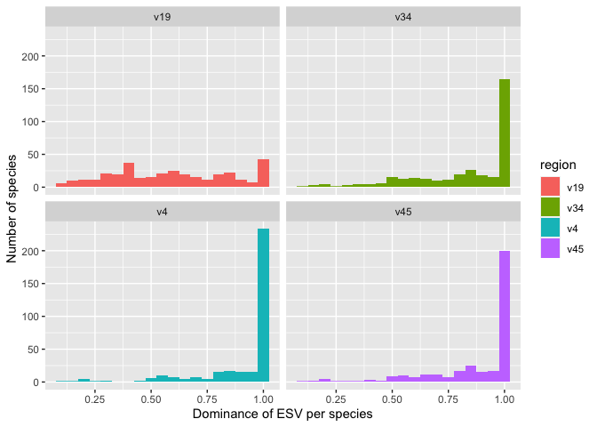
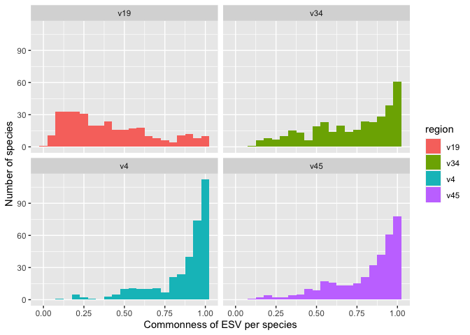

Quantifying the dominance and commoness of ESVs
================
Pat Schloss
11/02/2020

    library(tidyverse)
    library(here)
    library(knitr)

    metadata <- read_tsv(here("data/references/genome_id_taxonomy.tsv"),
                                             col_types = cols(.default = col_character())) %>%
        mutate(strain = if_else(scientific_name == species,
                                                        NA_character_,
                                                        scientific_name)) %>%
        select(-scientific_name)

    esv <- read_tsv(here("data/processed/rrnDB.easv.count_tibble"),
                                    col_types = cols(.default = col_character(),
                                                                     count = col_integer())) %>%
        filter(threshold == "esv") %>%
        select(-threshold)

    metadata_esv <- inner_join(metadata, esv, by=c("genome_id" = "genome"))

maybe there are many ESVs but only a handful of them are dominant?

    # want the number of genomes and average number of 16S rRNA gene (rrn) copies per
    # genome for each species

    n_genomes_rrn_copies_per_species <-
        metadata_esv %>%
        # need the counts by region and by genome for each species
      select(region, genome_id, species, easv, count) %>%
        # group our ESVs by region and species
      group_by(region, species) %>%
      summarize(
        # number of distinct genomes per region/species
        n_genomes = n_distinct(genome_id),
        # summing up the number of 16S rRNA copies across all genomes for
        # a species and region and divide by number of genomes
        mean_rrns = sum(count) / n_genomes,
        .groups="drop"
      )

    # set the minimum number of genomes per species
    min_n_genomes_per_species <- 5

    # What percentage of genomes have an ESV? This focuses on the most
    # common ESV for each species. Dominance is the percentage of genomes that an
    # ESV is found in. So if a ESV shows up in 20 of 25 genomes for a species, it
    # dominance is 0.80.

    esv_dominance_per_species <-

        metadata_esv %>%

        # want to do our analysis for the species level for each region of 16S will
        # want to group our genomes by ESVs and species to count the number of genomes
        # that each ESV appears in
      select(region, genome_id, species, easv, count) %>%
      group_by(region, species, easv) %>%

        # count the number of genomes that each ESV appears in for region and species
        summarize(n_genomes_found = n_distinct(genome_id), .groups="drop") %>%

        # bring in the number of genomes and rrn copies per species so we can scale
        # our number of genomes that each ESV appeared in to get percent dominance
      inner_join(., n_genomes_rrn_copies_per_species, by=c("region", "species")) %>%
      mutate(dominance = n_genomes_found / n_genomes) %>%

        # want the dominant ESV for each region and species
        # want the number of genomes for each species and region so that we can filter
        #   our data to focus on those species with more genomes than the value of
        #   threshold
      group_by(region, species) %>%
      summarize(
        n_genomes=max(n_genomes),
        max_dominance = max(dominance),
        .groups="drop"
        ) %>%
      filter(n_genomes >= min_n_genomes_per_species)

    esv_dominance_per_species %>%
      ggplot(aes(x=max_dominance, fill=region)) +
        geom_histogram(binwidth=0.05) +
        facet_wrap(facet="region") +
            labs(y="Number of species", x="Dominance of ESV per species")

<!-- -->

    # what percentage of species have a max dominance over 80%
    esv_dominance_per_species %>%
        group_by(region) %>%
      summarize(fraction = sum(max_dominance > 0.80)/n())

    ## `summarise()` ungrouping output (override with `.groups` argument)

    ## # A tibble: 4 x 2
    ##   region fraction
    ##   <chr>     <dbl>
    ## 1 v19       0.254
    ## 2 v34       0.654
    ## 3 v4        0.813
    ## 4 v45       0.744

    esv_commonness_per_species <- metadata_esv %>%

        # want to do our analysis for the species level for each region of 16S will
        # want to group our genomes by ESVs and species to count the number of genomes
        # that each ESV appears in
      select(region, genome_id, species, easv, count) %>%
      group_by(region, species, easv) %>%

        # instead of counting the number of genoems an ESV is found in, I want to
        # count the total number of times each ESV appears across the genomes within
        # a species
        summarize(n_esvs = sum(count), .groups="drop") %>%

        # bring in the number of genomes and rrn copies per species so we can scale
        # our number of times that each ESV appeared in each species to get percent
        # commonness
      inner_join(., n_genomes_rrn_copies_per_species, by=c("region", "species")) %>%
      mutate(commonness = n_esvs/n_genomes/mean_rrns) %>%

        # want the most common ESV for each region and species
        # want the number of genomes for each species and region so that we can filter
        #   our data to focus on those species with more genomes than the value of
        #   threshold
        group_by(region, species) %>%
      summarize(n_genomes=max(n_genomes),
        max_commonness = max(commonness),
        .groups="drop") %>%
      filter(n_genomes >= min_n_genomes_per_species)

    esv_commonness_per_species %>%
      ggplot(aes(x=max_commonness, fill=region)) +
        geom_histogram(binwidth=0.05) +
        facet_wrap(facet="region") +
            labs(y="Number of species", x="Commonness of ESV per species")

<!-- -->

    # what percentage of species have an ESV that has a commonness over 80%
    esv_commonness_per_species %>%
      group_by(region) %>%
      summarize(fraction = sum(max_commonness > 0.80)/n())

    ## `summarise()` ungrouping output (override with `.groups` argument)

    ## # A tibble: 4 x 2
    ##   region fraction
    ##   <chr>     <dbl>
    ## 1 v19       0.123
    ## 2 v34       0.461
    ## 3 v4        0.735
    ## 4 v45       0.628

### Conclusions…

-   Among the sub-regions, a majority of species have an ESV that is
    found in more than 80% of the genomes. For full length sequences,
    only 25% of ESVs are found across more than 80% of the genomes
-   The most common ESVs (i.e. more than 80% of the rrn copies) account
    for 46-74% of the genomes in the sub-regions and only 12% for the
    full length ESVs
-   Underscores the problem that a single ESV is unlikely to be
    representative of the diversity of ESVs within the species
