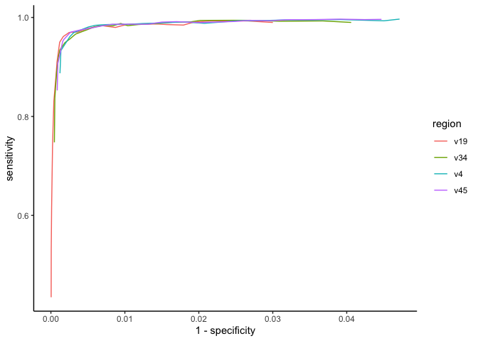
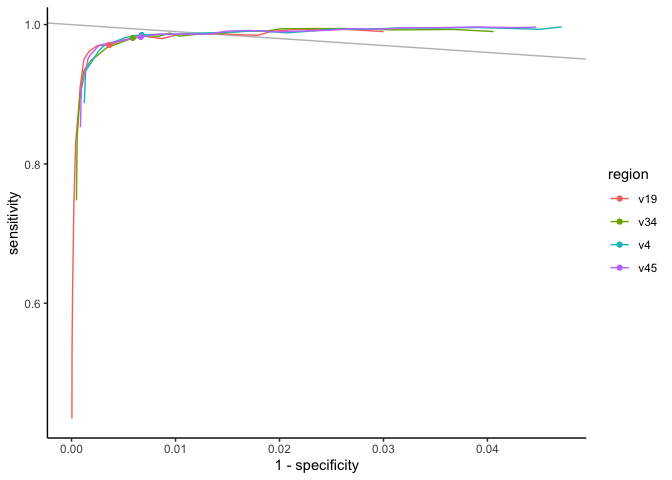
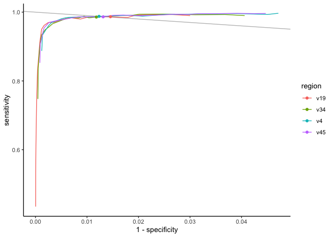

Balancing sensitivity and specificity by varying the ASV definition
================
Pat Schloss
12/21/2020

    library(tidyverse)
    library(here)
    library(knitr)

    sensitivity_specificity <- read_tsv(here("data/processed/rrnDB.roc.tsv"),
                                                         col_types = cols(.default = col_double(),
                                                                                         region = col_character()
                                                                                         )
                                                         ) %>%
        mutate(sensitivity = true_pos / (true_pos + false_neg),
                     specificity = true_neg / (true_neg + false_pos)) %>%
        group_by(region, threshold) %>%
        summarize(sensitivity = median(sensitivity),
                            specificity = median(specificity),
                            .groups="drop") %>%
        select(region, threshold, sensitivity, specificity)

### Overivew

The sensitivity and specificity of assigning 16S rRNA gene sequences to
ASVs relative to the genome/species have tradeoffs. We see these
tradeoffs in whether ASVs from the same genome are split apart
(i.e. sensitivity) or whether genomes from different species have the
same ASV (i.e. specificity). As we’ve discussed, we’d like to prioritize
minimizing the likelihood that we split genomes apart (i.e. high
specificity), but minimizing lumping (i.e. low specificity). We can look
at how both measures vary with the threshold used to define ASVs.

-   sensitivity (true positive rate): true\_pos / (true\_pos +
    false\_neg)
-   specificity (true negative rate): true\_neg / (true\_neg +
    false\_pos)

### Receiver operator characteristic curve (ROC curve)

    sensitivity_specificity %>%
        ggplot(aes(x=1-specificity, y=sensitivity, color=region)) + 
        geom_line() +
        theme_classic()

<!-- -->

### What are the sensitivity and specificity at a 3% difference?

    three <- sensitivity_specificity %>%
        filter(threshold == 0.03)

    three

    ## # A tibble: 4 x 4
    ##   region threshold sensitivity specificity
    ##   <chr>      <dbl>       <dbl>       <dbl>
    ## 1 v19         0.03       0.971       0.996
    ## 2 v34         0.03       0.981       0.994
    ## 3 v4          0.03       0.985       0.993
    ## 4 v45         0.03       0.982       0.993

    sensitivity_specificity %>%
        ggplot(aes(x=1-specificity, y=sensitivity, color=region)) + 
        geom_abline(intercept=1, slope=-1, color="gray") +
        geom_line() +
        geom_point(data=three, aes(x=1-specificity, y=sensitivity, color=region)) +
        theme_classic()

<!-- -->

### What threshold provides the equal balance of sensitivity and specificity?

    balance <- sensitivity_specificity %>%
        mutate(diff=abs(sensitivity - specificity)) %>%
        group_by(region) %>%
        summarize(min_diff = min(diff),
                            threshold = threshold[which.min(diff)],
                            sensitivity = sensitivity[which.min(diff)],
                            specificity = specificity[which.min(diff)],
                            .groups="drop"
                            )

    balance

    ## # A tibble: 4 x 5
    ##   region  min_diff threshold sensitivity specificity
    ##   <chr>      <dbl>     <dbl>       <dbl>       <dbl>
    ## 1 v19    0.00128       0.06        0.987       0.985
    ## 2 v34    0.00249       0.055       0.986       0.988
    ## 3 v4     0.0000417     0.045       0.988       0.988
    ## 4 v45    0.000531      0.04        0.986       0.987

    sensitivity_specificity %>%
        ggplot(aes(x=1-specificity, y=sensitivity, color=region)) + 
        geom_abline(intercept=1, slope=-1, color="gray") +
        geom_line() +
        geom_point(data=balance, aes(x=1-specificity, y=sensitivity, color=region)) +
        theme_classic()

<!-- -->

### What threshold provides a sensitivity and specificity closest to perfect classification?

    distance <- sensitivity_specificity %>%
        mutate(distance = sqrt((specificity - 1)^2 + (sensitivity - 1)^2)) %>%
        group_by(region) %>%
        summarize(min_distance = min(distance),
                            threshold = threshold[which.min(distance)],
                            sensitivity = sensitivity[which.min(distance)],
                            specificity = specificity[which.min(distance)],
                            .groups="drop"
                            )

    distance

    ## # A tibble: 4 x 5
    ##   region min_distance threshold sensitivity specificity
    ##   <chr>         <dbl>     <dbl>       <dbl>       <dbl>
    ## 1 v19          0.0175     0.055       0.987       0.988
    ## 2 v34          0.0154     0.045       0.988       0.991
    ## 3 v4           0.0163     0.035       0.986       0.992
    ## 4 v45          0.0160     0.035       0.986       0.992

    sensitivity_specificity %>%
        ggplot(aes(x=1-specificity, y=sensitivity, color=region)) + 
        geom_abline(intercept=1, slope=-1, color="gray") +
        geom_line() +
        geom_point(data=distance, aes(x=1-specificity, y=sensitivity, color=region)) +
        theme_classic()

<!-- -->

### Conclusions…

-   We need more points going out to 0.10
-   We need more points between percent thresholds (e.g. 0.025)
-   Appears that “larger” thresholds provide the best balance and
    overall classification of ASVs relative to genomes/species
